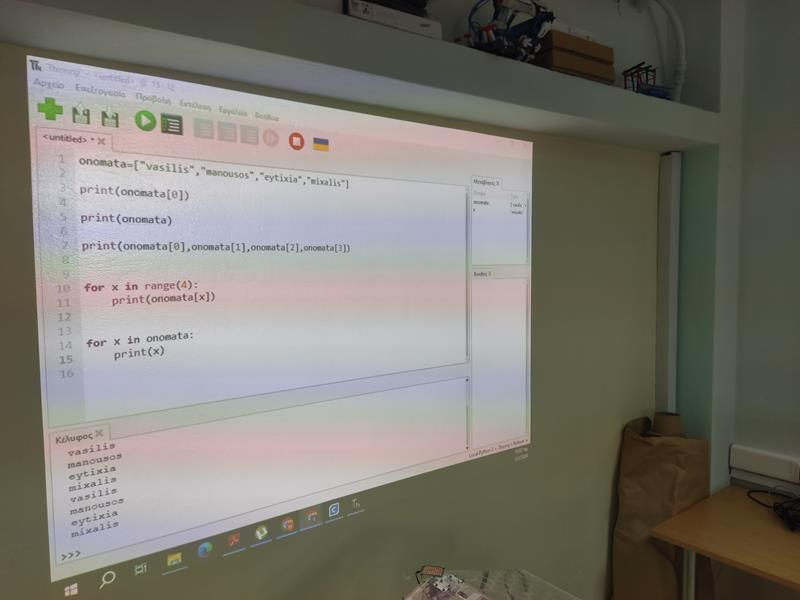
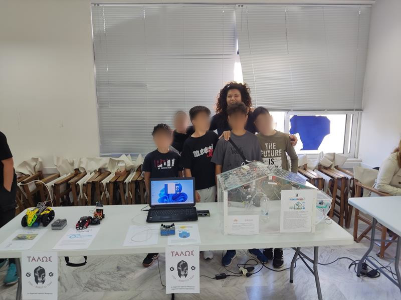
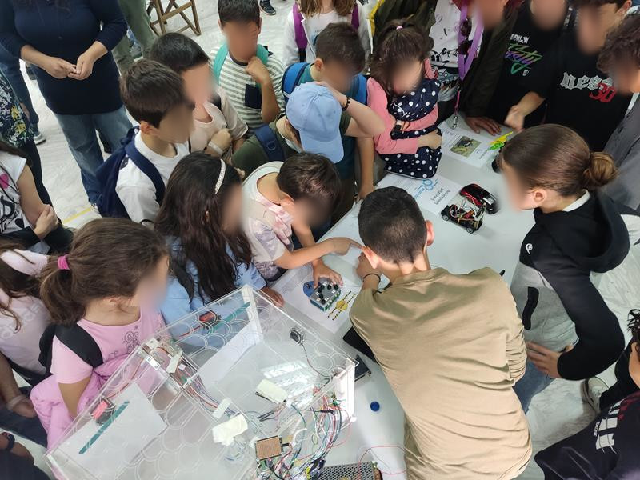
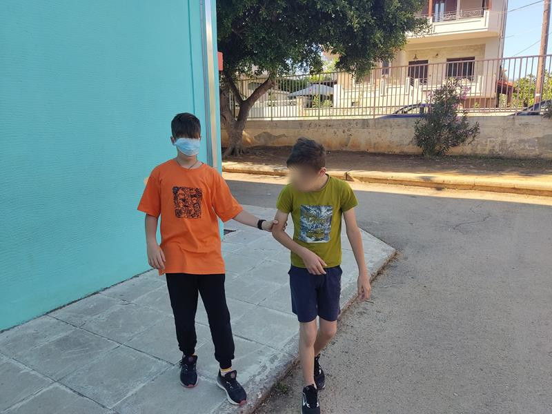
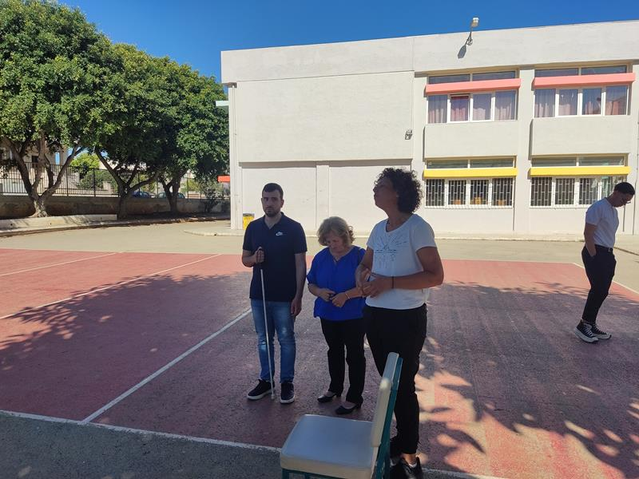

# The Pocket breille project


<div>
  
## <u>Το πρόβλημα</u>

Όλες οι αισθήσεις στη ζωή του κάθε ανθρώπου είναι πολύ σημαντικές. Μια από τις σημαντικότερες όμως, που η στέρησή της επηρεάζει πολύ σημαντικά τη ζωή του ατόμου είναι η όραση. Έχουμε φανταστεί άραγε τον εαυτό μας χωρίς αυτή; Έχουμε κλείσει έστω και για λίγο τα μάτια μας και να προσπαθήσουμε να κάνουμε ακόμα και το πιο απλό πράγμα της καθημερινότητας μας; Σίγουρα θα είναι πάρα πολύ δύσκολο ακόμα και να περπατήσουμε.
Με αυτό το project θα προσπαθήσουμε να βοηθήσουμε τους ανθρώπους αυτούς στην καθημερινότητα τους.


## <u>Η λύση</u>

Το project αναφέρεται στη δημιουργία ενός φορητού, μικρού σε μέγεθος και εύχρηστου πληκτρολογίου για τη μέθοδο γραφής breille.  Το σύστημα θα ενσωματώνει λειτουργίες αναγνώρισης του κώδικα breille, αυτόματη μετατροπή του κώδικα σε γράμμα ή σύμβολο, αποστολή του κάθε γράμματος μέσω της θύρας usb σε αντίστοιχο λογισμικό στον υπολογιστή που είναι συνδεμένη η συσκευή. 
Στη μεριά του υπολογιστή θα κατασκευάσουμε λογισμικό το οποίο θα λειτουργεί σαν απλός κειμενογράφος για ανθρώπους με προβλήματα όρασης. Θα ενσωματώσουμε τεχνολογία τεχνητής νοημοσύνης TTS (Text to speech) έτσι ώστε το άτομο να μπορεί να ακούει αυτά που γράφει και να διαχειρίζεται το περιβάλλον ακουστικά.
Το σύστημα θα υποστηρίζεται από φορητό υπολογιστή παλάμης.

Θα ασχοληθούμε με,

- Μικροελεγκτές Arduino
- Γλώσσα προγραμματισμού C++
- Γλώσσα προγραμματισμού Python
- Κατασκευή GUI με τη χρήση Tkinter
- Κατασκευή υπολογιστή παλάμης με τη χρήση raspberry pi για την ενσωμάτωση του λογισμικού
- Χρήση τεχνολογίας TTS
- Linux distributions σαν βασικό περιβάλλον εργασίας και δημιουργίας
- 3d εκτυπώσεις για τη φιλοξενία του εξοπλισμού


</div>

<div style="text-align: left; ">

## <u>Συμμετέχοντες</u>

### Υπεύθυνος εκπαιδευτικός

Μανούσακας Μανούσος - Εκπαιδευτικός Πληροφορικής ΠΕ86

### Μαθητές

Βασίλης Γκιουμές </BR>
Ευτυχία Κόρκακα </BR>
Φίλιππος Ιγγλεζάκης </BR>
Μανούσος Μαραγκουδάκης </BR>
Μανούσος Ξύδης </BR>
Μυρτώ Καροπούλου </BR>
Μιχάλης Αργυρίου </BR>
Παναγιώτης Κρασάκης </BR>


</div>

<div>

# <u>Γενικά στοιχεία σεναρίου</u>

## Σενάριο δραστηριότητας

Αριθμός μαθητών: 8  
Αριθμός Ομάδων: 4  
Αριθμός ατόμων ανά ομάδα: 2  
Είδος δραστηριότητας: Ομαδοσυνεργατική  
Ρόλοι: Δεν υπάρχουν διακριτοί ρόλοι στην ομάδα.  
Ηλικιακή ομάδα: 12-15  

## Φάση προετοιμασίας

Οι μαθητές θα πρέπει να:  
- Διερευνήσουν στο διαδίκτυο σχετικά με το θέμα.
- Να αναζητήσουν τις ανάγκες που μπορεί να έχουν οι άνθρωποι με τύφλωση.
- Να αναζητήσουν τη μέθοδο γραφής breille και να ανακαλύψουν τον κώδικά της.
- Συντάξουν ένα έντυπο όπου θα περιγράφουν τις προδιαγραφές του project.
- Να αναζητήσουν στο διαδίκτυο πληροφορίες για τον τρόπο λύσης και τις επιλογές του υλικού.  

## Φάση σχεδιασμού

Οι μαθητές θα πρέπει να:
- Να αναζητήσουν στο διαδίκτυο πληροφορίες για τη συνδεσμολογία του υλικού με το Arduino.
- Να αναζητήσουν στο διαδίκτυο πληροφορίες για τις προδιαγραφές των αισθητήρων.
- Να δημιουργήσουν στο Fritzing τις παραπάνω συνδεσμολογίες.  

## Φάση υλοποίησης

Οι μαθητές θα πρέπει να:  
- Δημιουργήσουν τις φυσικές συνδέσεις των υλικών τους.
- Να προγραμματίσουν το Arduino χρησιμοποιώντας το περιβάλλον Arduino IDE έτσι ώστε να μετατρέπει κάθε γράμμα σε breille σε γράμμα της αλφαβήτου και να το στέλνουν μέσω usb σειριακά στον υπολογιστή.
- Να δημιουργήσουν πρόγραμμα με τη χρήση της γλώσσας python που θα λαμβάνει το γράμμα που εχει αποσταλεί σειριακά
- Να δημιουργήσουν πρόγραμμα με τη χρήση του python interface έτσι ώστε να δημιουργήσουν ενα GUI καλάληλα κατασκευασμένο για χρήση απο τυφλά άτομα.
- Να ενσωματώσουν τεχνολογία τεχνιτής νοημοσύνης TTS έτσι ώστε να γίνεται η λειτουργία του προγράμματος ακουστικά. Για παράδειγμα σε περίπρωση που το ποντίκι περάσει πάνω απο κάποιο κουμπί να γίνεται ανάγνωση της επιγραφής του.


## Φάση Δοκιμών

Οι μαθητές θα πρέπει να:  
- Δοκιμάσουν τον εξοπλισμό τους και να επιβεβαιώσουν τη σωστή λειτουργία του.  
  
  
## Open Educational Resources
  

# Υλικά ηλεκτρονικά

|Είδος|Ποσότητα|Τιμή Μονάδας|Σύνολο|Περιγραφή|
|---|---|---|---|---|
|</BR>Raspberry Pi 4 - Model B - 4GB|1|79.90|79.90|https://grobotronics.com/raspberry-pi-4-model-b-4gb.html|
|</BR>Push Button Latching - 12.5mm Red|8|0.50|4.00|https://grobotronics.com/push-button-latching-12.5mm-red.html|
|</BR>Proto Shield Rev3 (Uno Size)|1|14.80|14.80|https://grobotronics.com/proto-shield-rev3-uno-size.html|
|</BR>Uno SMD Compatible - CH340|1|9.90|9.90|https://grobotronics.com/compatible-uno-smd-ch340.html|
|</BR>Pi Display 4" HDMI 800x480 IPS Resistive Touchscreen|1|44.90|44.90|https://grobotronics.com/pi-display-4-hdmi-800x480-ips-resistive-touchscreen.html|
|</BR>Νήμα PLA Chameleon 1.75mm PrimaSelect - Μπλε/Πράσινο 750g|1|34.90|34.90|https://grobotronics.com/primaselect-pla-chameleon-1.75mm-750g-spool-blue-green.html|
||||||
|||Σύνολο|188.4||
|||||| 

  
</div>


# Θεωρητικό μέρος
___


# :video_camera: **Ενότητα** :one: :<br>
 ## Τεχνητή Νοημοσύνη
  <div align="left">
      <a href="https://www.youtube.com/watch?v=i0Ig3LdG-p4">
         
      </a>
      <a href="https://www.youtube.com/watch?v=0dKkMS5-0jA">
         
      </a>
      <a href="https://www.youtube.com/watch?v=7a2aNF-dRo8">
         
      </a>
      <a href="https://www.youtube.com/watch?v=20VNny661UY">
         
      </a>
      <a href="https://www.youtube.com/watch?v=67ik8tnxqlE">
         
      </a>
      <a href="https://www.youtube.com/watch?v=yUSj9VsM82U">
         
      </a>
      <a href="https://www.youtube.com/watch?v=PVDguCvRwEs">
         
      </a>
   
 </div>


___

# :books: **Ενότητα** :two: :<br>

  <div align="left">


### Η γραφή Braille
Η γραφή Braille είναι ένα σύστημα γραφής και ανάγνωσης για τυφλά και αμβλύωπα άτομα. Προσφέρει ένα τρόπο για τη μετάδοση γραπτών μηνυμάτων χρησιμοποιώντας την αφή. Αυτό το σύστημα επιτρέπει στους τυφλούς να διαβάζουν και να γράφουν, επικοινωνώντας με το περιβάλλον τους.

Η γραφή Braille αναπτύχθηκε από τον Louis Braille, ένα τυφλό Γάλλο παιδί, το 1824. Ο Braille είχε ως στόχο να δημιουργήσει ένα σύστημα που θα επέτρεπε στους τυφλούς να διαβάζουν και να γράφουν με ανεξαρτησία. Αρχικά, το σύστημα Braille βασίζονταν σε μια απλή γραμμή από 12 κουκίδες, αλλά αργότερα εξελίχθηκε σε ένα πιο πολύπλοκο σύστημα με 6 κουκίδες που δημιουργούν διάφορους συνδυασμούς.

Οι κουκίδες της γραφής Braille αποτελούνται από δύο στήλες με τρεις οριζόντιες θέσεις. Κάθε κουκίδα μπορεί να είναι ενεργή (υψωμένη) ή ανενεργή (κατεβασμένη), δημιουργώντας έτσι 63 δυνατές συνδυασμένες κουκίδες. Αυτές οι κουκίδες αντιπροσωπεύουν τόσο γράμματα όσο και αριθμούς, σύμβολα και άλλα γραφικά στοιχεία.

Για παράδειγμα, το γράμμα “A” αναπαρίσταται από την ενεργή κουκίδα στην πρώτη θέση της πρώτης στήλης. Το γράμμα “B” αναπαρίσταται από την ενεργή κουκίδα στη δεύτερη θέση της πρώτης στήλης. Έτσι, με το σύστημα Braille, οι τυφλοί μπορούν να διαβάζουν και να γράφουν χρησιμοποιώντας τις άκρες των δαχτύλων τους για να αισθάνονται τις κουκίδες.

Η γραφή Braille χρησιμοποιείται ευρέως σε όλο τον κόσμο και έχει γίνει η πρωταρχική μέθοδος επικοινωνίας για τυφλούς. Έχει ενσωματωθεί σε πολλά είδη υλικών, όπως βιβλία, πληκτρολόγια, οθόνες υπολογιστών και άλλες συσκευές. Επίσης, υπάρχουν ειδικές σχολές και εκπαιδευτικά προγράμματα που διδάσκουν τη γραφή Braille σε τυφλά άτομα.

Η γραφή Braille έχει επηρεάσει τη ζωή πολλών ατόμων με προβλήματα όρασης, δίνοντάς τους τη δυνατότητα να αποκτήσουν ανεξαρτησία και να απολαύσουν τη λογοτεχνία, τη μάθηση και την επικοινωνία. Είναι ένα από τα πιο σημαντικά εργαλεία για την κοινωνική ένταξη και τη βελτίωση της ποιότητας ζωής των ατόμων με προβλήματα όρασης.


### Η γλώσσα προγραμματισμού PYTHON

Η γλώσσα προγραμματισμού Python είναι μια υψηλού επιπέδου, διερμηνευόμενη γλώσσα προγραμματισμού που δημιουργήθηκε από τον Guido van Rossum και κυκλοφόρησε για πρώτη φορά το 1991. Η Python έχει σχεδιαστεί με έμφαση στην αναγνωσιμότητα του κώδικα και την απλότητα, κάτι που την καθιστά ιδανική για αρχάριους προγραμματιστές.

Μία από τις βασικές αρχές της Python είναι η φιλοσοφία του “υπάρχει μόνο ένας σωστός τρόπος να γίνει κάτι”. Αυτή η φιλοσοφία προωθεί την απλότητα και τη σαφήνεια στον κώδικα, καθιστώντας τον ευανάγνωστο και ευκολότερο στη συντήρηση. Επίσης, η Python υποστηρίζει μια μεθοδολογία προγραμματισμού που ονομάζεται “βαθμωτός προγραμματισμός”, όπου ο κώδικας γράφεται σε μικρές, αυτόνομες μονάδες που είναι ευκολότερο να διαχειριστεί και να επαναχρησιμοποιηθεί.

Η Python χρησιμοποιεί ένα συντακτικό που βασίζεται σε κενά (whitespace), γνωστό και ως “Pythonic”. Αυτό σημαίνει ότι ο κώδικας δομείται μέσω των κενών αλλά και των αλλαγών γραμμής, κάτι που καθιστά τον κώδικα πιο ευανάγνωστο και οργανωμένο. Επίσης, η Python υποστηρίζει δυναμική τυποποίηση, που σημαίνει ότι ο τύπος μιας μεταβλητής δεν χρειάζεται να δηλωθεί εκ των προτέρων και μπορεί να αλλάξει κατά τη διάρκεια της εκτέλεσης του προγράμματος.

Η Python έχει ευρύ φάσμα εφαρμογών και χρησιμοποιείται σε πολλές διάφορες περιπτώσεις. Από την ανάπτυξη λογισμικού γενικής χρήσης, όπως εφαρμογές γραφείου και ιστοσελίδες, μέχρι την επιστημονική προγραμματισμό και την ανάλυση δεδομένων. Επίσης, η Python έχει γίνει δημοφιλής στον τομέα της τεχνητής νοημοσύνης και του μηχανικού μάθηματος, καθώς παρέχει πλούσιες βιβλιοθήκες και εργαλεία για αυτές τις εφαρμογές.

Μερικά από τα χαρακτηριστικά που καθιστούν τη Python ιδιαίτερα δημοφιλή είναι:

- Απλότητα: Η Python έχει σχεδιαστεί με έμφαση στην απλότητα και τη συνοχή του κώδικα. Ο συντακτικός της είναι ευανάγνωστος και ευκολονόητος, καθιστώντας την ιδανική για αρχάριους προγραμματιστές.

- Ευελιξία: Η Python υποστηρίζει δυναμική τυποποίηση και δυναμική δέσμευση μνήμης, επιτρέποντάς στους προγραμματιστές να αλλάζουν τύπους μεταβλητών και να δημιουργούν νέες μεταβλητές χωρίς περιορισμούς.

- Εκτελεστής πολλών πλατφορμών: Η Python είναι διαθέσιμη για πολλές πλατφόρμες, συμπεριλαμβανομένων των Windows, macOS, Linux και πολλών άλλων. Αυτό την καθιστά ευέλικτη για ανάπτυξη λογισμικού σε διάφορα περιβάλλοντα.

- Συνοψίζοντας, η Python είναι μια δημοφιλής γλώσσα προγραμματισμού που έχει σχεδιαστεί για να είναι απλή, ευανάγνωστη και ευέλικτη. Χρησιμοποιείται σε πολλές εφαρμογές και περιβάλλοντα, από την ανάπτυξη λογισμικού γενικής χρήσης έως την τεχνητή νοημοσύνη και την ανάλυση δεδομένων.

### Τι είναι το Tkinter

Η γλώσσα tkinter είναι μια βιβλιοθήκη προγραμματισμού που χρησιμοποιείται για την ανάπτυξη γραφικών διεπαφών χρήστη (GUI) σε Python. Το όνομα “tkinter” προέρχεται από τη συνδυασμένη χρήση των λέξεων “Tk” και “inter”, όπου το “Tk” αναφέρεται στη βιβλιοθήκη Tkinter και το “inter” στο γεγονός ότι αλληλεπιδρά με το περιβάλλον Python.

Η Tkinter αποτελεί μέρος της βασικής εγκατάστασης της Python, οπότε δεν απαιτεί επιπλέον εγκατάσταση. Παρέχει μια σειρά από κλάσεις και μέθοδους που επιτρέπουν τη δημιουργία και τη διαχείριση γραφικών στοιχείων, όπως παράθυρα, κουμπιά, ετικέτες, πλαίσια κ.λπ. Η Tkinter χρησιμοποιεί τη βιβλιοθήκη Tk για την απεικόνιση των γραφικών στοιχείων και προσφέρει μια απλή και ευέλικτη δομή για τη δημιουργία εφαρμογών με γραφική διεπαφή.

Η Tkinter χρησιμοποιείται ευρέως για την ανάπτυξη desktop εφαρμογών με γραφική διεπαφή χρήστη στη γλώσσα προγραμματισμού Python. Είναι μία από τις πλέον δημοφιλείς βιβλιοθήκες GUI για Python και προσφέρει μεγάλη ευκολία χρήσης και ευελιξία. Η Tkinter υποστηρίζει τη δημιουργία πολλών διάφορων στοιχείων GUI, όπως κουμπιά, πλαίσια, ετικέτες, κουτιά επιλογής, πεδία κειμένου κ.λπ., και παρέχει δυνατότητες για τη διαχείριση γεγονότων και αλληλεπίδραση με τον χρήστη.

Με τη βοήθεια της Tkinter, ο προγραμματιστής μπορεί να δημιουργήσει γρήγορα και εύκολα εφαρμογές με γραφική διεπαφή χρήστη που μπορούν να εκτελεστούν σε διάφορα λειτουργικά συστήματα, όπως Windows, macOS και Linux. Η Tkinter προσφέρει επίσης δυνατότητες για την προσαρμογή και την επέκταση των γραφικών στοιχείων, καθώς και για τη δημιουργία πολύπλοκων διεπαφών χρήστη.

Συνολικά, η γλώσσα tkinter αποτελεί ένα ισχυρό εργαλείο για τη δημιουργία γραφικών διεπαφών χρήστη σε Python, που προσφέρει ευκολία χρήσης, ευελιξία και δυνατότητες προσαρμογής.
    
### Η τεχνολογία TTS
    
   Το TTS (Text-to-Speech) είναι μια τεχνολογία που μετατρέπει κείμενο σε ομιλία. Απλά λόγια, αυτή η τεχνολογία επιτρέπει στους υπολογιστές να διαβάζουν και να προφέρουν κείμενο με φυσική ανθρώπινη φωνή. Χρησιμοποιώντας διάφορους αλγόριθμους και τεχνικές, το TTS μπορεί να αναγνωρίσει τους χαρακτήρες και τη σύνταξη του κειμένου και να το μετατρέψει σε φωνητική έκφραση.

Η τεχνολογία TTS έχει εφαρμογές σε πολλά πεδία. Για παράδειγμα, μπορεί να χρησιμοποιηθεί για να διαβάσει δυνατά κείμενα σε ατομικούς υπολογιστές, smartphone, tablet ή άλλες συσκευές. Αυτό είναι ιδιαίτερα χρήσιμο για άτομα με προβλήματα όρασης, καθώς τους επιτρέπει να ακούν το κείμενο αντί να το διαβάζουν. Επίσης, μπορεί να χρησιμοποιηθεί σε εφαρμογές που απαιτούν φωνητική αλληλεπίδραση, όπως προγράμματα πλοήγησης GPS, εφαρμογές βιντεοπαιχνιδιών και πρόγραμμα ανάγνωσης βιβλίων.

Η τεχνολογία TTS βασίζεται σε δύο βασικά συστήματα: τη σύνθεση φωνής και τη σύνθεση κειμένου. Η σύνθεση φωνής αναφέρεται στη δημιουργία φυσικής ανθρώπινης φωνής από τον υπολογιστή. Αυτό περιλαμβάνει τη χρήση δεδομένων φωνής, όπως ηχογραφήσεις από ανθρώπους που μιλούν, και τη χρήση αλγορίθμων για να μετατραπούν αυτά τα δεδομένα σε ήχο. Η σύνθεση κειμένου αφορά τη μετατροπή του γραπτού κειμένου σε φωνητική έκφραση. Αυτό περιλαμβάνει τη χρήση γλωσσικών μοντέλων και αλγορίθμων για να αποδώσει το κείμενο με φυσική προφορά και ένταση.

Η τεχνολογία TTS έχει σημειώσει σημαντική πρόοδο τα τελευταία χρόνια, κυρίως λόγω της ανάπτυξης των νευρωνικών δικτύων. Αυτά τα δίκτυα μπορούν να μάθουν από μεγάλα σύνολα δεδομένων και να παράγουν φυσική φωνή με εξαιρετική ποιότητα και ρεαλισμό. Ως εκ τούτου, οι εφαρμογές TTS γίνονται όλο και πιο αποδοτικές και ρεαλιστικές.

Συνοψίζοντας, το TTS είναι μια τεχνολογία που μετατρέπει κείμενο σε ομιλία, επιτρέποντας στους υπολογιστές να προφέρουν κείμενο με φυσική ανθρώπινη φωνή. Αυτή η τεχνολογία έχει εφαρμογές σε πολλά πεδία και βασίζεται σε συστήματα σύνθεσης φωνής και κειμένου.

### Raspberry pi

Το Raspberry Pi είναι ένας μικρός υπολογιστής μονόπλευρης πλακέτας που αναπτύχθηκε από το Raspberry Pi Foundation. Αυτός ο μικρός υπολογιστής προσφέρει μια οικονομική και εύχρηστη λύση για την εκμάθηση προγραμματισμού, των ηλεκτρονικών και των υπολογιστικών δεξιοτήτων.

Το Raspberry Pi έχει σχεδιαστεί για να είναι προσβάσιμο σε όλους και να ενθαρρύνει τους ανθρώπους να ανακαλύψουν τη δύναμη του υπολογισμού και τη δημιουργία. Με μέγεθος που αντέχει στο χέρι, το Raspberry Pi μπορεί να συνδεθεί σε οποιαδήποτε οθόνη, πληκτρολόγιο και ποντίκι, καθιστώντας τον ιδανικό για εκπαιδευτικές, ερευνητικές και δημιουργικές εφαρμογές.

Το Raspberry Pi λειτουργεί με ένα λειτουργικό σύστημα που βασίζεται στο Linux και υποστηρίζει πολλές γλώσσες προγραμματισμού, όπως Python, Scratch, Java και C++. Αυτό το καθιστά ιδανικό για αρχάριους προγραμματιστές που θέλουν να μάθουν τη βάση του προγραμματισμού.

Το Raspberry Pi διαθέτει επίσης αρκετές επεκτάσεις GPIO (General Purpose Input/Output), που επιτρέπουν τη σύνδεση με διάφορα ηλεκτρονικά και αισθητήρια. Αυτό το χαρακτηριστικό το καθιστά ιδανικό για προγραμματισμό και εφαρμογές σχετικές με το Internet of Things (IoT).

Με την ανάπτυξη του Raspberry Pi, έχουν δημιουργηθεί πολλά ενδιαφέροντα projects και εφαρμογές. Μπορεί να χρησιμοποιηθεί για τη δημιουργία ρομπότ, έξυπνων συστημάτων ελέγχου, media center, δικτύων και πολλών άλλων.


 </div>


___

# Κατασκευή Πληκτρολογίου Braille <br>

# :nut_and_bolt: **Ενότητα** :three: :wrench:<br>

## Open educational resources project


## Περιγραφή λειτουργίας συστήματος

Η κατασκευή αποτελείται από δύο μέρη. 
Το πρώτο μέρος αποτελεί το πληκτρολόγιο. Το πληκτρολόγιο αποτελείτε από 6 κουμπιά τα οποία είναι συνδεδεμένα με ένα Arduino nano. Σκοπός του είναι να ανιχνεύει τα πατήματα των πλήκτρων και να δημιουργεί μια ακολουθία 6 ψηφίων από 0 και 1. Το ψηφίο 1 σημαίνει ότι το κουμπί πατιέται ενώ το 0 το κουμπί δεν πατιέται.
Για παράδειγμα αν πατηθούν τα κουμπιά 1 και 2 τότε η ακολουθία θα είναι 110000.
Η ακολουθία αυτή στη συνέχεια αποστέλλεται στο δεύτερο σύστημα για επεξεργασία.
Το δεύτερο σύστημα αποτελείται από ένα Raspberry pi με λειτουργικό σύστημα raspbian os και από μία οθόνη αφής με εγκατεστημένους τους κατάλληλους οδηγούς λειτουργίας.
Σκοπός του υποσυστήματος είναι η επεξεργασία και η παρουσίαση των δεδομένων καθώς και η διεπαφή με τον χρήστη με το κατάλληλο γραφικό περιβάλλον. Αυτό επιτεύχθηκε με τη χρήση της γλώσσας python σε συνδυασμό με το tkinter. Αφού λάβει την ακολουθία των δεδομένων από τη σειριακή θύρα που έστειλε το σύστημα του πληκτρολογίου, τα αντιστοιχεί με το κατάλληλο γράμμα της γλώσσας μας, και στη συνέχεια το προβάλει την οθόνη και με τη χρήση τεχνολογίας TTS το εκφωνεί από τα ηχεία.
Σε περίπτωση που ο χρήστης αφήσει κενό τότε του διαβάζει την προηγούμενη λέξη.
Έχουν δημιουργηθεί και κουμπιά σε στρατηγικά και εύκολα προσβάσιμα σημεία, όπου ο χρήστης να έχει τη δυνατότητα να ακούσει ολόκληρο το κείμενο, την τελευταία γραμμή του κειμένου, να αποθηκεύσει το κείμενό του ή να το φορτώσει και να συνεχίσει από εκεί που έμεινε.

## :wrench: Εκτύπωση κομματιών στον 3d εκτυπωτή
<a href="https://github.com/talos-robotics/Pocket-breille-project/blob/main/3dprints/Top.stl">
         - Πάνω μέρος
 </a>
<br/>
 
 <a href="https://github.com/talos-robotics/Pocket-breille-project/blob/main/3dprints/Bottom.stl">
         - Κάτω μέρος
 </a>

 <br/>
 <a href="https://github.com/talos-robotics/Pocket-breille-project/blob/main/3dprints/2xmiddle.stl">
        - 2 x Μεσαίο κομμάτι
 </a>

## Σχέδιο Σύνδεσης


## Διάγραμμα ροής


## Κώδικας για το Arduino

```C
void setup() {

  //Στη συνάρτηση setup αρχικοποιούμε τη συριακή θύρα με ταχύτητα 9.600 kb το 
  //δευτερολεπτο.
  Serial.begin(9600);
  
  //Επίσης, αρχικοποιούμε τις ακίδες 2 3 4 5 6 και 7 έτσι ώστε να είναι ακίδες εισόδου. 
  pinMode(2,INPUT);
  pinMode(3,INPUT);
  pinMode(4,INPUT);
  pinMode(5,INPUT);
  pinMode(6,INPUT);
  pinMode(7,INPUT);

}

void loop() {
  
  //Στη συνάρτηση loop δημιουργούμε ισάριθμες μεταβλητές τύπου ακεραίου, όσες το πλήθος 
  //των ακίδων και μέσα στην κάθε μεταβλητή τοποθετούμε την ψηφιακή ανάγνωση της 
  //συγκεκριμένης ακίδας. Ουσιαστικά οι τιμές που θα περιέχουν μέσα θα είναι το 0 ή το 1. Αν 
  //το κουμπί πατηθεί θα περιέχει την τιμή 1 όταν δεν είναι πατημένο την τιμή 0.
  int sensorval2=digitalRead(2);
  int sensorval3=digitalRead(3);
  int sensorval4=digitalRead(4);
  int sensorval5=digitalRead(5);
  int sensorval6=digitalRead(6);
  int sensorval7=digitalRead(7);

  //Δημιουργούμε ένα πίνακα 6 θέσεων με όνομα buffer τύπου χαρακτήρων. Εκεί θα 
  //αποθηκεύουμε όλες τις τιμές από όλα τα κουμπιά. 
  char buffer[6];
  //Με την εντολή sprintf δημιουργούμε μία ακολουθία από τις τιμές που περιέχουν οι 
  //μεταβλητές των κουμπιών έτσι ώστε να φτιάξουμε ένα μοναδικό κωδικό με μηδέν και 1 για 
  //το κάθε γράμμα ή σύμβολο ή αριθμό. Την ακολουθία που θα δημιουργήσει την τοποθετεί 
  //μέσα στον πίνακα buffer που δημιουργήσαμε προηγουμένως.
  sprintf(buffer, "%d%d%d%d%d%d", sensorval2, sensorval3, sensorval4, sensorval5, sensorval6, sensorval7) ;

  //Αν η ακολουθία που περιέχεται μέσα στο buffer είναι όλα μηδενικά τότε σημαίνει ότι δεν έχει 
  //πατηθεί κάποιο κουμπί οπότε δεν στέλνει τίποτα στη σειριακή θύρα.
  if (String(buffer)!="000000"){
    Serial.println(buffer);
  }

  //Δημιουργούμε μία παύση 300 ms.
  delay(300);
}


```
___

# Εγκατάσταση και παραμετροποίηση Raspberry pi<br>

# :bookmark_tabs: **Ενότητα** :four: <br>

## Εκτύπωση κομματιών στον 3d εκτυπωτή

 <a href="https://github.com/talos-robotics/Pocket-breille-project/blob/main/3dprints/Stand.stl">
         Raspberry pi stand
 </a>

## Εγκατάσταση λειτουργικού συστήματος στο Raspberry pi

 <a href="https://www.youtube.com/watch?v=5DaYK3UKmDk">
         
 </a>

<br/><br/><br/>
 <a href="https://el.linux-console.net/?p=12150#gsc.tab=0">
     Εγκαταστήστε ένα λειτουργικό σύστημα στο Raspberry Pi σας
 </a>

 

## Παραμετροποίηση λειτουργικού στο Raspberry pi για τη λειτουργία της οθόνης waveshare

 <a href="https://www.youtube.com/watch?v=0BsDy5CiRUU">
         
 </a>

<br/><br/>
<a href="https://www.waveshare.com/wiki/4inch_HDMI_LCD">
     Αναλυτικές οδηγίες από την επίσημη σελίδα της εταιρίας
 </a>

<br/>
<a href="https://github.com/waveshare/LCD-show">
     Αποθετήριο των οδηγών χρήσης της εταιρίας
 </a>

## Είμαι απλός χρήστης και θέλω να εγκαταστήσω το λειτουργικό σύστημα έτοιμο και παραμετροποιημένο

Άν θέλετε να εγκαταστήσετε το λειτουργικό σύστημα με προεγκατεστημένη την οθόνη τότε μπορείτε να κατεβάσετε <BR>
το λειτουργικό απο την παρακάτω διεύθυνση και να ακολουθήσετε τα βήματα παραπάνω για το εγκαταστήσετε στην κάρτα SD.<BR>

<a href="http://www.lcdwiki.com/4inch_HDMI_Display-C#Download_Resources">
    Λειτουργικό συστήματα με προεγκατεστημένη την οθόνη (Θα τα βρείτε στο τέλος της σελίδας)
 </a>

<div>


 ## Εγκατάσταση Βιβλιοθηκών Python
  <div align="left">

Στο τερματικό του raspbian
    
Δημιουργούμε ένα νέο εικονικό περιβάλλον εργασίας Python
- python3 -m venv pocketbraille

Ενεργοποιούμε το περιβάλλον αυτό
- cd pockerbraille
- source bin/activate

Κάνουμε εγκατάσταση τις βιβλιοθήκες με τη χρήση του εργαλείου pip3
- pip3 install pillow
- pip3 install serial
- pip3 install serial-tool
- pip3 install pygame
- pip3 install gtts
- pip3 install thread
   
 </div>


## Διάγραμμα ροής


 ## Κώδικας Python

```Python
#Εισαγωγή βιβλιοθηκών από την python 
from tkinter import *
from tkinter import ttk
from tkinter import scrolledtext
import serial
import serial.tools.list_ports as ports
import threading
import gtts
import pygame
from PIL import Image, ImageTk

#Δημιουργία μεταβλητής exitthread που παίρνει τιμές 0-1, έτσι ώστε όταν πατήσουμε το
#κουμπί έξοδος να πάρει τιμή 1 και να μπορέσει να σταματήσει το νήμα που έχουμε
#δημιουργήσει παρακάτω. 
global exitthread

#Αρχικοποίηση της μεταβλητής exit thread σε 0 
exitthread=0

#Αρχικοποίηση της μεθόδου mixer
pygame.mixer.init()

#Άνοιγμα σειριακής θύρας 
try:
    SerialPortObj = serial.Serial('/dev/ttyACM0')
except:
    pass

#Συνάρτηση για την εκφώνηση του αρχείου read text.mp3 από τη βιβλιοθήκη pygame. Αυτή
#εκτελείται όταν το ποντίκι περάσει πάνω από το κουμπί που γράφει διάβασε κείμενο. 
def readbutshout(e):
    pygame.mixer.music.load("readtext.mp3")
    pygame.mixer.music.play()
    
#Συνάρτηση για την εκφώνηση του αρχείου exit.mp3 από τη βιβλιοθήκη pygame. Αυτή
#εκτελείται όταν το ποντίκι περάσει πάνω από το κουμπί που γράφει έξοδος. 
def readbutshout2(e):
    pygame.mixer.music.load("exit.mp3")
    pygame.mixer.music.play()
    
#Συνάρτηση για την εκφώνηση του αρχείου last line.mp3 από τη βιβλιοθήκη pygame. Αυτή
#εκτελείται όταν το ποντίκι περάσει πάνω από το κουμπί που γράφει διάβασε τελευταία γραμμή.
def readbutshout3(e):
    pygame.mixer.music.load("lastline.mp3")
    pygame.mixer.music.play()
    
#Συνάρτηση για την εκφώνηση του αρχείου save.mp3 από τη βιβλιοθήκη pygame. Αυτή
#εκτελείται όταν το ποντίκι περάσει πάνω από το κουμπί που γράφει αποθήκευση κειμένου. 
def readbutshout4(e):
    pygame.mixer.music.load("save.mp3")
    pygame.mixer.music.play()
    
 
#Συνάρτηση για την εκφώνηση του αρχείου open txt.mp3 από τη βιβλιοθήκη pygame. Αυτή
#εκτελείται όταν το ποντίκι περάσετε πάνω από το κουμπί που γράφει άνοιγμα αρχείου.    
def readbutshout5(e):
    pygame.mixer.music.load("opentxt.mp3")
    pygame.mixer.music.play()
    

#Συνάρτηση για την ανάγνωση της τελευταίας γραμμής.  
def readlastlinetext():
    #Δημιουργία του ηχητικού αποσπάσματος για τους 50 τελευταίους χαρακτήρες του scroll text
    #με όνομα txt.
    tts = gtts.gTTS(str(txt.get("end-50c" , "end")), lang="el")
    #Αποθήκευση του ηχητικού στο δίσκο με όνομα grami.mp3.
    tts.save("grami.mp3")
    #Αναπαραγωγή ηχητικού στα ηχεία. 
    pygame.mixer.music.load("grami.mp3")
    pygame.mixer.music.play()

#Συνάρτηση για την αποθήκευση του κειμένου που γράψαμε στο σκληρό δίσκο. 
def savetext():
    
    try:
        #Άνοιγμα αρχείου για εγγραφή με όνομα savedtxt.txt.
        with open("savedtxt.txt", 'w') as file:
            #Τοποθέτηση όλου του κειμένου από το scroll text στη μεταβλητή με όνομα text_content.
            text_content = txt.get("1.0", "end-1c")
            #Εγγραφή του περιεχομένου της μεταβλητής text_content στο αρχείο.
            file.write(text_content)
            
    except:
        #Αν υπάρξει σφάλμα εμφανίζει το μήνυμα error writing file. 
        print("error writing file")

#Συνάρτηση για το άνοιγμα του αποθηκευμένου αρχείου. 
def opentext():
    #Άνοιγμα αρχείου για ανάγνωση. 
    f = open("savedtxt.txt", "r")
    #Διάβασμα περιεχομένου του αρχείου και τοποθέτηση στη μεταβλητή opentxt.
    opentxt = f.read()
    #Τοποθέτηση του περιεχομένου της μεταβλητής opentxt στο scroll text.
    txt.insert(INSERT,str(opentxt))

#Συνάρτηση που εκτελείται όταν πατήσουμε το κουμπί έξοδος. 
def onexit():
    global exitthread
    #Αν είναι η σειριακή θύρα είναι ανοιχτή τότε την κλείνει και κάνει τη μεταβλητή exitthread ίσο
    #με 1 έτσι ώστε να σταματήσει να λειτουργεί το νήμα που έχουμε δημιουργήσει. 
    try:
        if SerialPortObj.is_open == True:
            SerialPortObj.close()
            exitthread=1
    except:
        pass
    #Κλείνουμε την εφαρμογή. 
    raise SystemExit
    
#Συνάρτηση για την ανάγνωση όλου του κειμένου.
def readtext():
    #Δημιουργία φωνητικού χρησιμοποιώντας το scrolltext από το χαρακτήρα 1 έως το τέλος. 
    tts = gtts.gTTS(str(txt.get( 1.0, "end")), lang="el")
    #Αποθήκευση φωνητικού που μόλις δημιουργήσαμε στο αρχείο text.mp3. 
    tts.save("text.mp3")
    #Αναπαραγωγή του ηχητικού που μόλις δημιουργήσαμε το αρχείο text.mp3
    #χρησιμοποιώντας τη βιβλιοθήκη pygame. 
    pygame.mixer.music.load("text.mp3")
    pygame.mixer.music.play()

#Συνάρτηση ανάγνωσης της σειριακής θήρας.
#Ουσιαστικά αυτό είναι το νήμα το οποίο εκτελείται συνεχώς και ελέγχει αν έφτασαν
#δεδομένα στη σειριακή θύρα και τα τοποθετεί μέσα σε μία μεταβλητή που ονομάζεται
#receivedstring, μετά από κατάλληλη επεξεργασία όπου αφαιρεί τα κενά με τη συνάρτηση
#rstrip και μετατρέπει το χαρακτήρα σε κωδικοποίηση utf 8. Το νήμα θα σταματήσει να
#επαναλαμβάνετε όταν η μεταβλητή exit thread θα πάρει την τιμή 1. 
def readport():
    global exitthread
    global receivedfive
    
    #Η συγκεκριμένη μεταβλητή ουσιαστικά λειτουργεί σαν διακόπτης όπου σε περίπτωση που
    #γίνει αληθής τότε ελέγχει τους συνδυασμούς οι οποίοι έχουν γράμματα με τόνους ή
    #σύμβολα.
    receivedfive=False
    
    
    #Σε αυτό το σημείο δημιουργούμε δύο διαφορετικούς δισδιάστατους πίνακες τον ένα τον
    #ονομάζουμε combinations και τον άλλο τον ονομάζουμε tonoscombinations. Αυτοί πίνακες
    #περιέχουν τους συνδυασμούς των πλήκτρων που πατατούνται με τα αντίστοιχα γράμματα η
    #σύμβολα.
    combinations=[["100000","α"],
                  ["110000","β"],
                  ["110110","γ"],
                  ["100110","δ"],
                  ["100010","ε"],
                  ["101011","ζ"],
                  ["001110","η"],
                  ["100111","θ"],
                  ["010100","ι"],
                  ["101000","κ"],
                  ["111000","λ"],
                  ["101100","μ"],
                  ["101110","ν"],
                  ["101101","ξ"],
                  ["101010","ο"],
                  ["111100","π"],
                  ["111010","ρ"],
                  ["011100","σ"],
                  ["011110","τ"],
                  ["101111","υ"],
                  ["110100","φ"],
                  ["110010","χ"],
                  ["111101","ψ"],
                  ["010110","ω"],
                  ["110001","αι"],
                  ["100101","ει"],
                  ["010101","οι"],
                  ["110111","υι"],
                  ["100001","αυ"],
                  ["100011","ευ"],
                  ["110011","ηυ"],
                  ["101001","ου"],
                  ["000001","-@-"],
                  ["111111","<-"],
                  ["011100","ς"],
                  ["111101",""],
                  ["101111",""],
                  ["010011","."],
                  ["010000",","],
                  ["010001",";"],
                  ["001000","'"]]
    
    
    tonoscombinations=[["100000","ά"],
                       ["100010","έ"],
                       ["001110","ή"],
                       ["010100","ί"],
                       ["010100","ΐ"],
                       ["101010","ό"],
                       ["101111","ύ"],
                       ["101111","ΰ"],
                       ["010110","ώ"],
                       ["010100","ϊ"],
                       ["101111","ϋ"]]

    
    while exitthread!=1:
        
        
        #Σε αυτό το σημείο οτιδήποτε λαμβάνει από τη σειριακή θύρα το τοποθετεί στη μεταβλητή
        #receivedstring. Αν αυτό που έλαβε στη μεταβλητή receivedstring είναι διαφορετικό από την
        #κωδικοποίηση 000010, δηλαδή να μην έχει πατηθεί το κουμπί 5 και η μεταβλητή
        #receivedfive να είναι ίση με ψευδές τότε ελέγχει μέσα στον πίνακα combinations σε ποιο
        #γράμμα αντιστοιχεί η συγκεκριμένη κωδικοποίηση. Όταν το εντοπίσει τότε προσθέτει το
        #γράμμα αυτό μέσα στη μεταβλητή specialchar.
       
        try:
            ReceivedString = SerialPortObj.readline().decode('utf-8').rstrip() 
            
            if ReceivedString!="000010" and receivedfive==False:
                for x in combinations:
                    if x[0] == ReceivedString:
                        spesialchar=x[1]
                        
            #Άν η κωδικοποίηση που έλαβα από τη σειριακή θύρα είναι όλα μηδενικά και η μεταβλητή
            #receivedfive είναι ίση με αληθές τότε σημαίνει ότι έχει πατηθεί το κουμπί 5. Τότε ψάχνει την
            #κωδικοποίηση στον πίνακα tonoscombinations. Όταν το βρει τότε προσθέτει το αντίστοιχο
            #γράμμα στη μεταβλητή specialchar.
            if ReceivedString!="000000" and receivedfive==True:
                for x in tonoscombinations:
                    if x[0] == ReceivedString:
                        spesialchar=x[1]
                        receivedfive=False
            
            #Αν η μεταβλητή receivedstring είναι ίση με 5 δηλαδή 000010, τότε κάνει τη μεταβλητή
            #receivedfive σε αληθές.
            if ReceivedString=="000010":
                receivedfive=True
            
            
            #Αν λάβουμε τον ειδικό χαρακτήρα -@- σημαίνει ότι θα τοποθετήσουμε τον χαρακτήρα κενό,
            #αφού τοποθετηθεί ο χαρακτήρας του κενού τότε σημαίνει ότι έχει ο χρήστης έχει
            #ολοκληρώσει να γράφει μία λέξη. Αυτή τη λέξη θέλουμε εμείς να την εκφωνήσουμε. Θα
            #πρέπει λοιπόν σε όλο το κείμενο που έχει γράψει να μπορέσουμε να βρούμε την τελευταία
            #λέξη έτσι ώστε να δημιουργήσουμε την εκφώνησή της. Για να το κάνουμε αυτό
            #δημιουργούμε μία λίστα με όνομα lis. Μέσα στη λίστα τοποθετούμε το κείμενο που έχει το
            #scrolltext αφού το έχουμε σπάσει σε λέξεις χρησιμοποιώντας τη συνάρτηση split (). Με αυτό
            #τον τρόπο αν πάρουμε το τελευταίο στοιχείο της λίστας τότε έχουμε την τελευταία λέξη που
            #έγραψε ο χρήστης. Στη συνέχεια δημιουργούμε την εκφώνηση της λέξης και
            #χρησιμοποιώντας το pygame την εκφωνούμε. 
            if spesialchar=="-@-":
                
                kimeno=txt.get("1.0", "end")
                lis = list(kimeno.split(" "))
                length = len(lis)
                print(lis[length-1])
                
                tts = gtts.gTTS(str(lis[length-1]), lang="el")
                tts.save("lexi.mp3")
                pygame.mixer.music.load("lexi.mp3")
                pygame.mixer.music.play()
                
                                
                txt.insert(INSERT," ")
            
            #Αν λάβουμε στη σειριακή θύρα των χαρακτήρα <- αυτό σημαίνει ότι ο χρήστης τέλη να
            #σβήσει το τελευταίο γράμμα που έγραψε. Χρησιμοποιώντας λοιπόν την εντολή txt.delete
            #διαγράφουμε του τελευταίου χαρακτήρα που γράφτηκε στο scroll text.
            elif spesialchar=="<-":
                txt.delete("end-2c","end")
            #Για οποιαδήποτε άλλη περίπτωση ό,τι λάβει από την σειριακή θύρα το προσθέτει στο τέλος
            #τους scroll text και στη συνέχεια δημιουργεί το φωνητικό αρχείο και το εκφωνεί μέσω της
            #βιβλιοθήκης pygame.
            else:
                txt.insert(INSERT,str(spesialchar))
                
                try:
                    tts = gtts.gTTS(spesialchar, lang="el")
                    tts.save("letter.mp3")
                    pygame.mixer.music.load("letter.mp3")
                    pygame.mixer.music.play()
                except:
                    print("error in letter")
                
               
                spesialchar=""
               
            
        except:
            print("error")
           

#Αν η σειριακή πόρτα είναι ανοιχτή τότε ξεκινάμε να εκτελούμε το νήμα. 
try:
    if SerialPortObj.is_open == True:
        t = threading.Thread(target=readport).start()
except:
    pass

#Σε αυτό το τμήμα κώδικα δημιουργούμε το γραφικό περιβάλλον χρήστη. 

#Δημιουργούμε το παράθυρο 
root = Tk()
#Δίνουμε ένα τίτλο στο παράθυρο που θα φαίνεται στην κορυφή του.
root.title("Pocket breille")
#Ορίζουμε το μέγεθος το παραθύρου σε 800 x 480 pixels 
root.geometry('800x480')
#Τροποποιούμε την ιδιότητα του παραθύρου έτσι ώστε να φαίνεται πάντα, όταν ξεκινάει το
#πρόγραμμα, σε πλήρη οθόνη.
root.wm_attributes('-fullscreen','true')

#Θα δημιουργήσουμε τρία frames το αριστερό το μεσαίο και το δεξιό τα οποία θα
#φιλοξενήσουν τα κουμπιά και το scroll text. Τα frame τα χρησιμοποιούμε για να μπορέσουμε
#να έχουμε μία σωστή διάταξη για τα αντικείμενά μας.

#Κατασκευάζουμε το αριστερό frame με ύψος 480 pixels και μήκος 100 pixels βάζουμε το
#background με χρώμα dodger blue 4. Του κάνουμε αριστερή στοίχιση.
left_frame= Frame(root, height=480,width=100, bg= "dodgerblue4")
left_frame.pack(side=LEFT)
left_frame.pack_propagate(0)

#Κατασκευάζουμε το μεσαίο frame με ύψος 480 pixels και πλάτος 570 pixels το background
#το βάζουμε dodger blue 3. Οι στοίχιση και σε αυτό είναι αριστερή.
middle_frame=Frame(root,height=480,width=570, bg= "dodgerblue3")
middle_frame.pack(side=LEFT)
middle_frame.pack_propagate(0)

#Κατασκευάζουμε το δεξιό frame με ύψος 480 pixels και πλάτος 130 pixels το background το
#βάζουμε dodger blue 4 και η στοίχιση του είναι δεξιά.
right_frame=Frame(root,height=480,width=130, bg= "dodgerblue4")
right_frame.pack(side=RIGHT)
right_frame.pack_propagate(0)

#Δημιουργούμε το κουμπί της εξόδου το τοποθετούμε στο δεξιό frame του ορίζουμε σαν
#εντολή να εκτελέσει τη συνάρτηση onexit καθώς επίσης ορίζουμε πως όταν περάσει ο
#δείκτης του ποντικιού πάνω από το κουμπί αυτό θα εκτελεί την συνάρτηση readbutshout2.
#Το κουμπί του τοποθετούμε στο κάτω μέρος του frame για αυτό ορίζουμε και τη λέξη bottom #έχουμε ορίσει αγκιστρωση νοτιοανατολική. 
closebut = ttk.Button(right_frame, text="Έξοδος",command=onexit)
closebut.bind("<Enter>", readbutshout2)
closebut.pack(side=BOTTOM,anchor=NE)

#Δημιουργούμε το κουμπί που διαβάζει το κείμενο το τοποθετούμε στο αριστερό frame και
#του ορίζουμε σαν εντολή να εκτελέσει τη συνάρτηση readtext. Το στοιχίζουμε στην κορυφή
#του frame. 
readbut = ttk.Button(left_frame, text="Διάβασε \n κείμενο", command=readtext)
readbut.bind("<Enter>", readbutshout)
readbut.pack(side=TOP)

#Δημιουργούμε το κουμπί που που ανοίγει το αρχείο που έχουμε αποθηκεύσει την
#προηγούμενη εργασία μας, το τοποθετούμε στο αριστερό frame, και το ορίζουμε σαν εντολή
#να εκτελέσει τη συνάρτηση opentext. Το στοιχίζουμε στο κάτω μέρος του frame. 
openbut = ttk.Button(left_frame, text="Άνοιγμα \n αρχείου", command=opentext)
openbut.bind("<Enter>", readbutshout5)
openbut.pack(side=BOTTOM)

#Δημιουργούμε το κουμπί που διαβάζει την τελευταία γραμμή. Το τοποθετούμε στο δεξιό
#πλαίσιο ευτυχισμένο στην κορυφή και ορίζουμε σαν εντολή να εκτελέσει τη συνάρτηση
#readlastlinetext. 
readlastlinebut = ttk.Button(right_frame, text="Διάβασε την \n τελευταία γραμμή", command=readlastlinetext)
readlastlinebut.bind("<Enter>", readbutshout3)
readlastlinebut.pack(side=TOP)

#Δημιουργούμε το κουμπί αποθήκευσης του κειμένου ορίζοντας σαν εντολή εκτελέσει τις
#συνάρτηση opentext. Το τοποθετούμε στο μεσαίο frame και το στοιχίζουμε στο κάτω μέρος
#του.
savebut = ttk.Button(middle_frame, text="Αποθήκευση κειμένου", command=savetext)
savebut.bind("<Enter>", readbutshout4)
savebut.pack(side=BOTTOM)

#Δημιουργούμε το skrolled text το οποίο θα εμφανίζεται στο μεσαίο frame και θα έχει ύψος
#999 χαρακτήρες.
txt = scrolledtext.ScrolledText(middle_frame, height=999, font=("Arial 30"))
txt.pack()

#Δημιουργούμε μία εικόνα και την τοποθετούμε μέσα σε ένα label στο δεξιό frame.
image = Image.open('images/pocketbreillelogo.png')
image = ImageTk.PhotoImage(image)
image_label = ttk.Label(right_frame, image=image)
image_label.pack(side=RIGHT, padx=20)

#Εκτελείται το loop γραφικού περιβάλλοντος της γλώσσας tkinter.
root.mainloop()


```

# :memo: **Ενότητα** :five:  Φύλλα Εργασίας <br>

<a href="https://github.com/talos-robotics/Pocket-breille-project/blob/main/work%20sheet/%CE%A6%CF%8D%CE%BB%CE%BB%CE%BF%20%CE%B5%CF%81%CE%B3%CE%B1%CF%83%CE%AF%CE%B1%CF%82%201%20-%20Arduino.pdf">
   Φύλλο εργασίας 1 <br>
 </a>
 <a href="https://github.com/talos-robotics/Pocket-breille-project/blob/main/work%20sheet/%CE%A6%CF%8D%CE%BB%CE%BB%CE%BF%20%CE%B5%CF%81%CE%B3%CE%B1%CF%83%CE%AF%CE%B1%CF%82%202%20-%20Arduino.pdf">
   Φύλλο εργασίας 2 <br>
 </a>
 <a href="https://github.com/talos-robotics/Pocket-breille-project/blob/main/work%20sheet/%CE%A6%CF%8D%CE%BB%CE%BB%CE%BF%20%CE%B5%CF%81%CE%B3%CE%B1%CF%83%CE%AF%CE%B1%CF%82%203%20-%20Arduino.pdf">
   Φύλλο εργασίας 3 <br>
 </a>
 <a href="https://github.com/talos-robotics/Pocket-breille-project/blob/main/work%20sheet/%CE%A6%CF%8D%CE%BB%CE%BB%CE%BF%20%CE%B5%CF%81%CE%B3%CE%B1%CF%83%CE%AF%CE%B1%CF%82%204%20-%20Python.pdf">
   Φύλλο εργασίας 4 <br>
 </a>
 <a href="https://github.com/talos-robotics/Pocket-breille-project/blob/main/work%20sheet/%CE%A6%CF%8D%CE%BB%CE%BB%CE%BF%20%CE%B5%CF%81%CE%B3%CE%B1%CF%83%CE%AF%CE%B1%CF%82%205%20-%20Python.pdf">
   Φύλλο εργασίας 5 <br>
 </a>


 
</div>


  
  <div>

# :warning: Τι να προσέξω - Αστοχίες και λάθη

- Το πλαίσιο και το κουτί θα μπορούσε να είναι στενότερο και μακρύτερο έτσι ώστε η διάταξη των πλήκτρων να είναι στη σειρά, όπως η γραφομηχανή braille.
- Καλύτερη ποιότητα κουμπιών
- Καλύτερη ποιότητα οθόνης
  
</div>
  
# :movie_camera: Βίντεο παρουσίαση

<a href="https://youtu.be/uG-WTTZHTPA">
         
</a>
 

<div>

# :camera: Φωτογραφικό υλικό

###  Προγραμματισμός - Κατασκευή πληκτρολογίου

|||||
|---|---|---|---|
|||||
|||||
|||||
|||||
|||||
|||||
|||||  

### Φεστιβάλ Ψηφιακής Δημιουργίας

|||||
|---|---|---|---|
|||||
|||||
|||||
|||||
||||
||||
|||||    
 

### Βιωματική Δράση

|||||
|---|---|---|---|
|||||
|||||
|||||
|||||
|||||
|||||
|||||
|||||
|||||    


# :pray: ΕΥΧΑΡΙΣΤΙΕΣ

Τον Οργανισμό Ανοιχτών Τεχνολογιών

Τη Διεύθυνση των σχολείων

Τη Γεωργία Νικηφοράκη
(Γυμνάστρια Ειδικής Αγωγής)

Το Γιώργο Πετράκη 
(Ψυχολόγος και beta tester)

  
</div>
